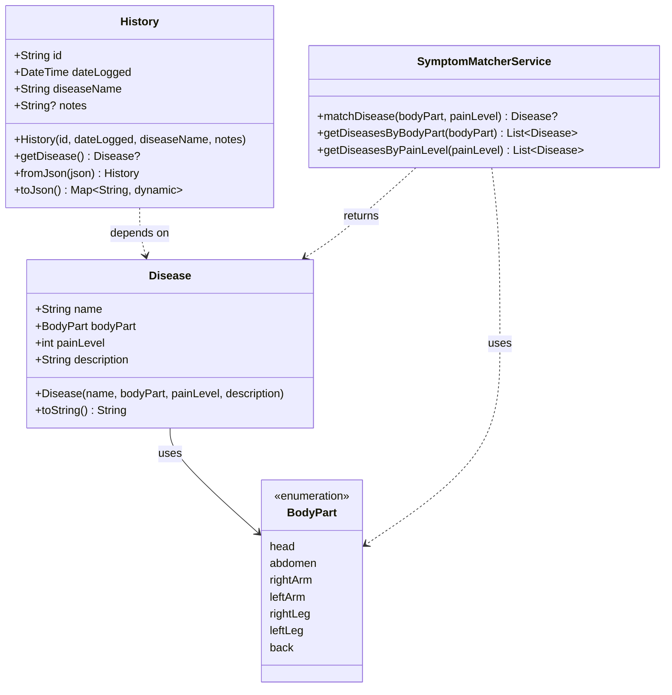

```mermaid
classDiagram
    class BodyPart {
        <<enumeration>>
        head
        abdomen
        rightArm
        leftArm
        rightLeg
        leftLeg
        back
    }

    class Disease {
        +String name
        +BodyPart bodyPart
        +int painLevel
        +String description
        +Disease(name, bodyPart, painLevel, description)
        +toString() String
    }

    class History {
        +String id
        +DateTime dateLogged
        +String diseaseName
        +String? notes
        +History(id, dateLogged, diseaseName, notes)
        +getDisease() Disease?
        +fromJson(json) History
        +toJson() Map~String, dynamic~
    }

    class SymptomMatcherService {
        +matchDisease(bodyPart, painLevel) Disease?
        +getDiseasesByBodyPart(bodyPart) List~Disease~
        +getDiseasesByPainLevel(painLevel) List~Disease~
    }

    Disease --> BodyPart : uses
    History ..> Disease : depends on
    SymptomMatcherService ..> Disease : returns
    SymptomMatcherService ..> BodyPart : uses
```